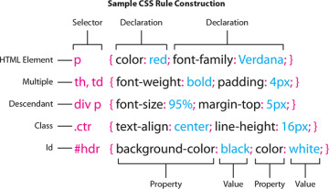
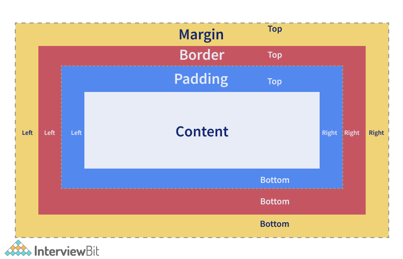
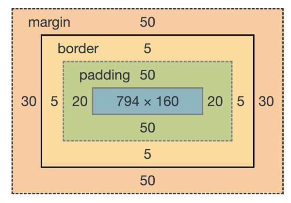

# CSS Introduction

CSS is the language we use to style a Web page.

# YouTube Link

[YouTube Video -1 - Basic CSS](https://www.youtube.com/watch?v=NdFVQ7YOAF4)

[YouTube Video -2 - Basic CSS](https://youtu.be/P6zj1LYauek)

[YouTube Video -3 - Basic CSS](https://youtu.be/C5TIsI-NAek)

[YouTube Video -4 - CSS FlexBox](https://youtu.be/c2vCBlVSQMs)

[YouTube Video -5 - Challenge](https://youtu.be/W0rj_mUo28k)

[YouTube Video -6 - Revision](https://youtu.be/zT0Igk4-CkQ)

[YouTube Video -7 - HTML/CSS - Card](https://youtu.be/VuFM5lhWIQc)

# What is CSS?

- CSS stands for Cascading Style Sheets
- CSS describes how HTML elements are to be displayed on screen, paper, or in other media
- CSS saves a lot of work. It can control the layout of multiple web pages all at once
- External stylesheets are stored in CSS files

# CSS Syntax


# CSS Selectors

CSS selectors are used to "find" (or select) the HTML elements you want to style.

## The CSS id Selector

- The id selector uses the id attribute of an HTML element to select a specific element.

- The id of an element is unique within a page, so the id selector is used to select one unique element!

- To select an element with a specific id, write a hash (#) character, followed by the id of the element.

```
#para1 {
 text-align: center;
 color: red;
}

```

## The CSS class Selector

- The class selector selects HTML elements with a specific class attribute.

- To select elements with a specific class, write a period (.) character, followed by the class name.

```
.center {
  text-align: center;
  color: red;
}


```

# The CSS Universal Selector

- The universal selector (\*) selects all HTML elements on the page.

```
* {
  text-align: center;
  color: blue;
}

```

# The CSS Grouping Selector

- The grouping selector selects all the HTML elements with the same style definitions.

- Look at the following CSS code (the h1, h2, and p elements have the same style definitions):

```
h1 {
  text-align: center;
  color: red;
}

h2 {
  text-align: center;
  color: red;
}

p {
  text-align: center;
  color: red;
}

```

```

h1, h2, p {
  text-align: center;
  color: red;
}

```

# CSS Rule Example



# CSS Colors

- Colors are specified using predefined color names, or RGB, HEX, HSL, RGBA, HSLA values.

## CSS Background Color / CSS Text Color / CSS Border Color

```
<h1 style="background-color:DodgerBlue;">Hello World</h1>
<p style="background-color:Tomato;">Lorem ipsum...</p>


<h1 style="color:Tomato;">Hello World</h1>
<p style="color:DodgerBlue;">Lorem ipsum...</p>
<p style="color:MediumSeaGreen;">Ut wisi enim...</p>

<h1 style="border:2px solid Tomato;">Hello World</h1>
<h1 style="border:2px solid DodgerBlue;">Hello World</h1>
<h1 style="border:2px solid Violet;">Hello World</h1>


```

## CSS Color Values

- In CSS, colors can also be specified using RGB values, HEX values, HSL values, RGBA values, and HSLA values:

```
<h1 style="background-color:rgb(255, 99, 71);">...</h1>
<h1 style="background-color:#ff6347;">...</h1>
<h1 style="background-color:hsl(9, 100%, 64%);">...</h1>

<h1 style="background-color:rgba(255, 99, 71, 0.5);">...</h1>
<h1 style="background-color:hsla(9, 100%, 64%, 0.5);">...</h1>


```

# CSS Backgrounds

- In these chapters, you will learn about the following CSS background properties:

- background-color
- background-image
- background-repeat
- background-attachment
- background-position
- background (shorthand property)

### background-color

- Sets the background color of an element

`Example:`

`Here, the <h1>, <p>, and <div> elements will have different background colors:`

```
h1 {
  background-color: green;
}

div {
  background-color: lightblue;
}

p {
  background-color: yellow;
}
```

### background-image

- The background-image property specifies an image to use as the background of an element.

- By default, the image is repeated so it covers the entire element.

body {
background-image: url("paper.gif");
}

### background-repeat

### background-attachment

### background-position

### background (shorthand property)

[Background](https://www.w3schools.com/css/css_background_repeat.asp)

# CSS Box Model






## Width and Height of an Element

```
Important: When you set the width and height properties of an element with CSS, you just set the width and height of the content area. To calculate the full size of an element, you must also add padding, borders and margins.

The total width of an element should be calculated like this:

Total element width = width + left padding + right padding + left border + right border + left margin + right margin

The total height of an element should be calculated like this:

Total element height = height + top padding + bottom padding + top border + bottom border + top margin + bottom margin
```

# CSS Borders

[CSS Borders](https://www.w3schools.com/css/css_border.asp)

# CSS Margins

[CSS Margins](https://www.w3schools.com/css/css_margin.asp)

# CSS Padding

[CSS padding](https://www.w3schools.com/css/css_padding.asp)

# CSS Height, Width and Max-width

[CSS Height, Width and Max-width](https://www.w3schools.com/css/css_dimension.asp)

# CSS Text

[CSS Text](https://www.w3schools.com/css/css_text.asp)

# CSS Fonts

[CSS Fonts](https://www.w3schools.com/css/css_font.asp)

# CSS Icons

[CSS Icons](https://www.w3schools.com/css/css_icons.asp)

[Font Awesome 5 Introduction](https://www.w3schools.com/icons/fontawesome5_intro.asp)

## Ionicons

[Ionicons](https://ionic.io/ionicons)

```
<script src="https://cdnjs.cloudflare.com/ajax/libs/ionicons/6.0.3/index.cjs.min.js" integrity="sha512-XA50v2jCBeXCjj3csHdYV4HLvACatDSmuN+qGW2CALMbjz4jqGpzf2Fi2WYbbcfex7n44oj1KUNpSWqg9BblhQ==" crossorigin="anonymous" referrerpolicy="no-referrer"></script>

```

# CSS Links

- With CSS, links can be styled in many different ways.

[CSS Links](https://www.w3schools.com/css/css_link.asp)

# CSS Lists

- HTML Lists and CSS List Properties

[CSS Lists](https://www.w3schools.com/css/css_list.asp)

# CSS Flex Box

[Flex-Box](https://css-tricks.com/snippets/css/a-guide-to-flexbox/)

# CSS Grid

[CSS Grid](https://css-tricks.com/snippets/css/complete-guide-grid/)

# CSS position Property

[Blog - position property](https://blog.hubspot.com/website/css-position)

CSS helps you to position your HTML element. You can put any HTML element at whatever location you like. You can specify whether you want the element positioned relative to its natural position in the page or absolute based on its parent element.

Now, we will see all the CSS positioning related properties with examples −

# What is the default position of HTML elements in CSS?

By default, the position property for all HTML elements in CSS is set to static. This means that if you don't specify any other position value or if the position property is not declared explicitly, it'll be static.

Visually, all elements follow the order of the HTML code, and in that way the typical document flow is created.

Elements appear one after the other – directly below one another, according to the order of the HMTL code.

## Relative Positioning

Relative positioning changes the position of the HTML element relative to where it normally appears. Now u are allowed to more the element to left, right, top, bottom

```
<html>
   <head>
   </head>

   <body>
      <div style = "position:relative; left:80px; top:2px; background-color:yellow;">
         This div has relative positioning.
      </div>
   </body>
</html>

```

## Absolute Positioning

An element with **position: absolute** is positioned at the specified coordinates relative to your screen top-left corner.

You can use two values top and left along with the position property to move an HTML element anywhere in the HTML document.

```
<html>
   <head>
   </head>

   <body>
      <div style = "position:absolute; left:80px; top:20px; background-color:yellow;">
         This div has absolute positioning.
      </div>
   </body>
</html>

```

## Fixed Positioning

Fixed positioning allows you to fix the position of an element to a particular spot on the page, regardless of scrolling. Specified coordinates will be relative to the browser window.

You can use two values top and left along with the position property to move an HTML element anywhere in the HTML document.

```
<html>
   <head>
   </head>

   <body>
      <div style = "position:fixed; left:80px; top:20px; background-color:yellow;">
         This div has fixed positioning.
      </div>
   </body>
</html>

```

## Sticky Positioning

Sticky positioning is really unique! A sticky element will just sit there like a static element, but as you scroll past it, if it’s parent element has room (usually: extra height) the sticky element will behave as if it’s fixed until that parent element is out of room.

## CSS Layers and Z-index

CSS gives you opportunity to create layers of various divisions. The CSS layers refer to applying the z-index property to elements that overlap with each other.

The z-index property is used along with the position property to create an effect of layers. You can specify which element should come on top and which element should come at bottom.

A z-index property can help you to create more complex webpage layouts. Following is the example which shows how to create layers in CSS.

```
<html>
   <head>
   </head>

   <body>
      <div style = "background-color:red;
         width:300px;
         height:100px;
         position:relative;
         top:10px;
         left:80px;
         z-index:2">
      </div>

      <div style = "background-color:yellow;
         width:300px;
         height:100px;
         position:relative;
         top:-60px;
         left:35px;
         z-index:1;">
      </div>

      <div style = "background-color:green;
         width:300px;
         height:100px;
         position:relative;
         top:-220px;
         left:120px;
         z-index:3;">
      </div>
   </body>
</html>

```

## Relative Units

Relative units are units that can change based on their context. There are several of them that you are likely to encounter and want to use.

## em and rem

em and rem both refer to a font size, though they are often used to define other sizes in CSS. You’ll see both of them often so we’re going to explain both, but as a rule-of-thumb, prefer rem.

1em is the font-size of an element (or the element’s parent if you’re using it to set font-size). So, for example, if an element’s font-size is 16px, then setting its width to 4em would make its width 64px (16 \* 4 == 64).

1rem is the font-size of the root element (either :root or html). The math works the same with rem as it did with em, but without the added complexity of keeping track of the parent’s font size. Relying on em could mean that a particular size could change if the context changes, which is very likely not the behavior you want.

Using a relative size like rem to define font sizes across your website is recommended. Many browsers allow users to change the base font-size to increase readability. If at all possible, it is advisable to respect a user’s wishes regarding font size. You’ll learn more about this from the reading assignments.

## Viewport Units

The units vh and vw relate to the size of the viewport. Specifically, 1vh is equal to 1% of the viewport height and 1vw is equal to 1% of the viewport width. These can be useful any time you want something to be sized relative to the viewport, examples including full-height heroes, full-screen app-like interfaces.

# CSS Reset

[CSS Tools: Reset CSS](https://meyerweb.com/eric/tools/css/reset/)

[Normalize](https://nicolasgallagher.com/about-normalize-css/)

# HTML and CSS Projects.

[Basic page structure - google doc](https://docs.google.com/document/d/144gpYdeVUQljEFQBK_-x5M4KSM3R9Dc7mLkQpQNFjwA/edit#heading=h.dnje4qsk4zbo)

## Project - 1

[Personal-portfolio](https://personal-portfolio.freecodecamp.rocks/)

## Project - 2

[tribute-page](https://tribute-page.freecodecamp.rocks/)

## Project - 3

[product-landing-page](https://product-landing-page.freecodecamp.rocks/)

## Project - 4

[mytunes](https://jolly-kalam-23776e.netlify.app/mytunes/)

## Project - 5

[resturant-page](https://jolly-kalam-23776e.netlify.app/restaurantwebsite/)

## Project - 6

[photographysite](https://jolly-kalam-23776e.netlify.app/photographysite/#images)

## Project - 7

[HTML-CSS Survay Form](https://survey-form.freecodecamp.rocks/)

## More project

[frontendmentor](https://www.frontendmentor.io/challenges?sort=difficulty|asc&types=free)

## Resoureces

- [The Odin project](https://www.theodinproject.com/paths/full-stack-javascript/courses/intermediate-html-and-css)
- [HTML Dog Tag List](http://www.htmldog.com/reference/htmltags/)
- [W3Schools Tag List](http://www.w3schools.com/tags/default.asp)
- [Quackit HTML Tag List](http://www.quackit.com/html/tags/)
