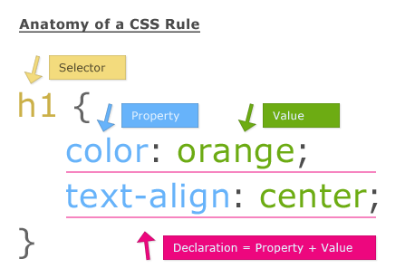

# CSS Introduction

CSS is the language we use to style a Web page.

# What is CSS?

- CSS stands for Cascading Style Sheets
- CSS describes how HTML elements are to be displayed on screen, paper, or in other media
- CSS saves a lot of work. It can control the layout of multiple web pages all at once
- External stylesheets are stored in CSS files

# CSS Syntax



# CSS Selectors

CSS selectors are used to "find" (or select) the HTML elements you want to style.

## The CSS id Selector
 
 - The id selector uses the id attribute of an HTML element to select a specific element.

 - The id of an element is unique within a page, so the id selector is used to select one unique element!

 - To select an element with a specific id, write a hash (#) character, followed by the id of the element.

 ```
#para1 {
  text-align: center;
  color: red;
}

 ```

## The CSS class Selector

- The class selector selects HTML elements with a specific class attribute.

- To select elements with a specific class, write a period (.) character, followed by the class name.

```
.center {
  text-align: center;
  color: red;
}


```

# The CSS Universal Selector
- The universal selector (*) selects all HTML elements on the page.

```
* {
  text-align: center;
  color: blue;
}

```

# The CSS Grouping Selector

- The grouping selector selects all the HTML elements with the same style definitions.

- Look at the following CSS code (the h1, h2, and p elements have the same style definitions):

```
h1 {
  text-align: center;
  color: red;
}

h2 {
  text-align: center;
  color: red;
}

p {
  text-align: center;
  color: red;
}

```

```

h1, h2, p {
  text-align: center;
  color: red;
}
 
```